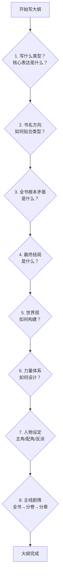

# 一部百万字网络小说的大纲应该是什么样子的

> 本文系统梳理网络小说（玄幻、仙侠、都市、历史等类型）百万字长篇大纲的结构方法论，并结合《斗破苍穹》《凡人修仙传》《庆余年》等代表性作品的实际案例进行深度分析。

---

## 一、为什么百万字长文必须有大纲

在网络文学创作圈，"不写大纲"是新老作者的通病。很多作者认为大纲限制了写作思维，但实践证明，不写大纲的长篇写作，80% 会在第 3 万字前放弃，剩下的则极易出现剧情写崩、前后逻辑矛盾、人物性格崩塌、不知道后续剧情可写等问题。[1]

对于百万字量级的作品而言，大纲的意义尤为突出。一部百万字小说通常需要连载数年，涉及数十个主要人物、数百个场景、若干条并行故事线，以及大量需要前后呼应的伏笔。没有大纲，作者几乎不可能在如此庞大的体量中保持叙事的一致性与逻辑的自洽性。[2]

从平台数据来看，87% 的签约作者使用大纲，有大纲的作者完稿效率平均提升 3.2 倍，读者好评率也显著更高。[3] 正如创作者常说的那句话：**大纲是地图，没有它你一定会迷路。**

---

## 二、大纲的层级结构：三级体系

百万字长篇大纲并非一份文件，而是一套**三级嵌套的文档体系**，从宏观到微观依次细化。[4]

| 层级 | 名称 | 篇幅参考 | 核心内容 |
|------|------|----------|----------|
| 第一级 | 总纲（粗纲） | 1000—5000 字 | 整本书的主线走向、开头、结局、核心矛盾 |
| 第二级 | 卷纲（分卷大纲） | 每卷 200—500 字 | 每卷的主线、支线、阶段目标、卷末悬念 |
| 第三级 | 章纲（细纲） | 每章 50—200 字 | 每章的核心事件、出场人物、伏笔、章末钩子 |

这三级结构的写作顺序是自上而下的：**先写总纲，再推演卷纲，最后从卷纲拆出章纲**。百万字长篇通常建议采用"总分总"结构——先写一个总纲，再拆分成 5—10 卷，每卷独立写细纲，卷与卷之间用悬念衔接。[3]

值得注意的是，大纲并非一成不变的合同。写作过程中可以根据灵感微调，但核心骨架（总纲层面的主线、结局、核心矛盾）不要轻易改动。

---

## 三、大纲的核心构成要素

一份完整的网络小说大纲，通常需要涵盖以下七个核心模块。[1] [5]

### 3.1 故事类型与卖点

这是大纲的起点，也是整本书的商业逻辑所在。作者需要明确：**我的书在卖什么？凭什么让读者付费？**

类型的划分通常与主角身份和金手指密切相关。以都市类为例，可细分为战神文、神医文、赘婿文、鉴宝文、都市修仙文等子类型。在各类型已被充分开发的当下，**多元素融合**成为差异化的主要手段，例如"战神 + 奶爸"、"神医 + 赘婿"、"修仙 + 商业"等组合。[1]

### 3.2 世界背景

世界背景是故事发生的容器，包含三个层次：

**世界介绍**：这是一个什么世界，有怎样的历史和发展脉络。玄幻小说需要描述大陆格局、灵气体系的由来；都市小说则需要交代时代背景和社会环境。

**势力划分**：这个世界包括哪些主要势力，各势力如何划分等级和地位，彼此之间的关系如何，重要人物的经历是什么。这是后续剧情冲突的来源。

**等级体系**：玄幻小说中的修炼等级、功法等级、武器等级、丹药等级；都市小说中的财富层级和权力结构。等级体系需要与各大势力挂钩，形成有机的世界逻辑。[5]

### 3.3 金手指设定

金手指是主角异于、强于其他人的地方或物品，是网络小说的核心爽点来源。需要特别强调的是，**金手指不仅仅指系统**，系统只是金手指的一种形式。[1]

典型的金手指形式包括：
- 神秘物品（《凡人修仙传》中能催熟灵药的神秘小瓶）
- 导师传承（《斗破苍穹》中戒指里的药老）
- 前世记忆（穿越文、重生文中的先知优势）
- 系统（各类系统文中的能力赋予机制）

金手指的设计原则是：**辅助主角完成主线任务，而非替代主线**。一个好的金手指与主线故事相互影响——金手指帮助主角达到目的，主角达到目的又促进金手指的成长和完善。[1]

### 3.4 主线与支线

**主线**是贯穿全文的核心驱动力，即主角主动或被动要去做的事情、要达到的目的。主线可以是主动型（想要变强、复仇、查明真相）或被动型（被追杀、必须完成任务才能解除自身困境）。[1]

**支线**是辅助主角完成主线故事的剧情。以玄幻文为例，主线是主角修炼成为最强者，而参加试炼、探索秘境、获取功法和丹药的剧情就属于支线。支线的核心要点是**必须与主线挂钩**，而非游离于主线之外的独立故事。

此外，**感情线**作为重要的情感支撑，需要设计好高潮、起伏和低谷的节奏，与主线形成张弛有度的配合。

### 3.5 人设

人设是网文创作中的重中之重。绝大多数能够出圈的书，出圈的原因都是因为人物的出众。[1]

人设塑造分为三个层次：

**第一层：人设不崩（基础）**。什么身份、什么性格的人，做什么事说什么话，保持一致性。

**第二层：有特点（记忆点）**。有两种方法：
- **灌装法**：把人设当成一个罐子，把符合人设的人物行为、语言填入其中，通过具体场景展现人物特质。
- **标签法**：把人物写得比较极端，形成鲜明的性格标签，让读者一眼就能记住。

**第三层：立体有血有肉**。人物有多重性格，在不同场景下展现不同面向，既符合人设又有意外之感。

对于反派的塑造，有一个重要原则：**如果换个视角，这本书就是反派的天下**。只有让反派有血有肉，行为处事有其自身逻辑，才能让整个故事的逻辑立住。[5]

### 3.6 分卷剧情（大结构）

分卷剧情是百万字大纲中最能体现作者全局掌控能力的部分。[1]

**大结构**：整本书分为多少卷，每一卷写什么，卷终的故事走到哪个层次，主角达到了什么目的。通常采用**反推法**：先确定结局，再反推主角如何到达，遇到哪些朋友和敌人，发生了什么感情纠葛，怎么解决冲突。

**小结构**：单个剧情的结构。以装逼打脸为例，可分为铺垫、压制、高潮、收尾四个部分，通过篇幅分配控制节奏。

**章结构**：每一章的内容可以用几句话提炼。如果提炼不出来，基本说明这一章内容空洞、节奏太慢。[1]

### 3.7 结局设计

结局是大纲中最先需要确定的内容之一。**知道终点，才能规划路径**。结局的设计不仅影响最终章节的写法，更影响全书伏笔的布局和人物命运的走向。

---

## 四、五种经典大纲结构模板

根据不同类型的网络小说，业界总结出了五种经过验证的经典大纲结构。[4]

### 4.1 三幕式（最通用）

三幕式是最基础的故事结构，适用于有明确起承转合的各类长篇：

- **第一幕（约 25%）**：建置——介绍角色和世界，制造"打破日常"的触发事件，主角被迫走上旅程
- **第二幕（约 50%）**：对抗——主角朝目标前进，遇到越来越大的阻碍；中间点是一个大转折（假胜利或假失败）；后半段阻碍加倍，主角跌入最低谷
- **第三幕（约 25%）**：解决——主角用成长后的自己解决最终危机，故事收尾

**玄幻示例**：废柴主角被退婚 → 偶然获得传承 → 决定变强（第一幕）→ 宗门大比大放异彩，却被发现用了禁术被逐出宗门 → 独自流浪被追杀，重伤濒死，悟出真正的力量（第二幕）→ 回归宗门，揭露反派阴谋，最终决战，成就一方强者（第三幕）[4]

### 4.2 升级打怪循环（网文最常用）

这是网文特有的"循环结构"，每个弧段都是一次"遇到更强对手 → 修炼变强 → 打败对手 → 进入新地图"的循环。[4]

```
核心循环：
新地图/新势力 → 低调装逼 → 结仇 → 修炼突破 → 打脸 → 获得奖励 → 更大的舞台
```

**分卷框架示例**：

| 卷次 | 舞台 | 修炼等级 | 反派级别 |
|------|------|----------|----------|
| 卷一 | 出生地图 | 练气期 | 地方恶霸 |
| 卷二 | 宗门 | 筑基期 | 内门长老 |
| 卷三 | 秘境/外域 | 金丹期 | 其他宗门天才 |
| 卷四 | 更大势力 | 元婴期 | 宗门掌权者 |
| …… | …… | …… | …… |

关键原则：每个循环里要有一个"超出预期"的差异化元素，不能纯套路。[4]

### 4.3 悬疑推理（线索驱动）

悬疑文的大纲逻辑是**从结局倒推**的，写大纲的顺序与其他类型相反：

1. 先确定真相（凶手是谁、动机、手法）
2. 把关键线索拆成 5—10 条
3. 确定每条线索出现的时机
4. 安排 2—3 条红鲱鱼（误导线索）
5. 最后才写"主角的视角"按顺序呈现[4]

### 4.4 群像叙事（多主角）

权谋文、宫斗文、多势力对抗文常用此结构。需要同时推进 3—5 条主角线，并在关键节点交汇。

**大纲框架示例**：
- 主线 A（王子复仇）：章 1 → 章 3 → 章 6 → 章 9 → 章 12
- 主线 B（公主暗棋）：章 2 → 章 4 → 章 7 → 章 10 → 章 12
- 主线 C（刺客觉醒）：章 3 → 章 5 → 章 8 → 章 11 → 章 12
- 交汇点：章 6（A 和 C 第一次碰面）、章 9（B 和 A 联手）、章 12（三线汇合大决战）[4]

群像大纲必须画时间轴，确保各条线的时间是同步的。

### 4.5 无限流/副本制（单元剧）

主线 + 单元结构，每个副本/世界是独立的小故事，主线贯穿所有副本。

**大纲框架**：
- 主线：主角被选中进入游戏 → 每通过一个副本获得一个线索 → 最终拼出游戏背后的真相
- 副本 1（生存类）：荒岛求生 → 3 章
- 副本 2（推理类）：密室杀人 → 4 章
- 副本 3（战斗类）：异世界战争 → 5 章[4]

---

## 五、各类型代表作品大纲案例解析

### 5.1 玄幻类：《斗破苍穹》（天蚕土豆，约 700 万字）

《斗破苍穹》是起点中文网第一本点击破亿的作品，是玄幻小白文的典范。[6]

**世界设定与等级体系**：

| 类别 | 内容 |
|------|------|
| 修炼等级 | 一至九段斗之气 → 斗者 → 斗师 → 大斗师 → 斗灵 → 斗王 → 斗皇 → 斗宗 → 斗尊 → 斗圣 → 斗帝 |
| 功法等级 | 天、地、玄、黄四个等级 |
| 职业体系 | 主流斗者 + 辅助职业（炼药师、炼器师） |
| 妖兽等级 | 一阶至九阶 |

**主角金手指**：药老（被禁锢在戒指中的九品炼药宗师），提供高级丹药、顶级功法和修炼指导。

**主线构架**：

```
开篇高潮：测试失败被认为废物 → 未婚妻上门悔婚（前期核心矛盾）
          ↓
前期（约100万字）：得到药老 → 三年之约 → 打怪升级、寻宝、炼药夺魁
          ↓
中期：赴三年之约 → 上云岚宗击败未婚妻，洗刷悔婚屈辱
          ↓
后期：消灭魂殿，救药老 → 揭开家族与上古世家联系的秘密
          ↓
终局：成为斗帝
```

**大纲特点分析**：《斗破苍穹》的大纲属于典型的"升级打怪 + 三幕式"混合结构。以"退婚打脸"为开篇高潮，前期紧紧围绕三年之约形成清晰的短期目标，后期逐步揭开家族秘密的宏大暗线。其成功在于**把卖点（爽感）与主线（成长）高度统一**，每一次升级都对应一次情感高潮。[7]

---

### 5.2 仙侠类：《凡人修仙传》（忘语，约 771 万字）

《凡人修仙传》是仙侠类最具代表性的作品之一，以"平凡人的修仙之路"为核心主题，全书约 771 万字。[8]

**三大篇章结构**：

| 篇章 | 字数（约） | 主角境界 | 核心主题 |
|------|-----------|----------|----------|
| 人界篇 | 322 万字 | 炼气 → 化神 | 在弱肉强食的修仙界中以谨慎和智谋求生存 |
| 灵界篇 | 约 230 万字 | 炼虚 → 大乘 | 在陌生的灵界重新建立立足之地 |
| 仙界篇 | 约 220 万字 | 渡劫 → 成道 | 仙界的最终历程 |

**人界篇分卷大纲**（共 7 卷）：

```
第一卷 七玄门风云（炼气期）
  入七玄门 → 得神秘小瓶 → 反杀墨大夫 → 卷入七玄门与野狼帮大战 → 悄然离去

第二卷 初踏修仙路（炼气期→筑基期）
  进入黄枫谷 → 参加太南小会 → 获得升仙令 → 培育灵药 → 获得筑基丹

第三卷 魔道入侵（筑基期）
  血色禁地试炼 → 筑基成功 → 越国大战爆发 → 传送阵逃生

第四卷 风起海外（筑基期→结丹期）
  乱星海冒险 → 二十年苦修 → 结丹突破

第五卷 通天大陆（结丹期→元婴期）
  进入更大舞台 → 元婴期突破

第六卷 通天大陆后期（元婴期→化神期准备）
  化神期前的积累与磨砺

第七卷 飞升灵界（化神期）
  化神期突破 → 飞升灵界
```

**大纲特点分析**：《凡人修仙传》的大纲是"平凡人成长"主题的极致体现。每一篇章都是一个相对完整的故事，有明确的阶段目标和终点。主角韩立的行事风格（谨慎、低调、善随机应变）贯穿始终，形成了鲜明的人物标签。其大纲的核心逻辑是**"每次飞升都是一次重生"**——人界、灵界、仙界各自构成一个完整的叙事单元，既保持连贯性，又给读者带来阶段性的满足感。[9]

---

### 5.3 架空历史/权谋类：《庆余年》（猫腻，约 396 万字）

《庆余年》是架空历史权谋类网文的标杆之作，2007 年发表，全书约 396 万字，826 章。[10]

**双线结构设计**：

```
明线：范闲的成长历程
  澹州少年时代 → 进京（春闱案、婚事）→ 出使北齐 → 回京权谋 → 下江南 → 最终决战

暗线：叶轻眉遗志与庆帝秘密
  叶轻眉（穿越者）的理想 → 庆帝的真实面目 → 陈萍萍的秘密 → 上一代恩怨的清算
```

**主要故事线（回京后）**：

1. 范闲与二皇子第一次交锋——鉴查院与督察院之争
2. 范闲与二皇子第二次交锋——抱月楼之争
3. 范闲保护遇刺的庆帝后身受重伤，身世曝光
4. 范闲下江南、掌内库、斗明家
5. 范闲出使北齐
6. 回京后的权力博弈
7. 最终决战：太子、二皇子、长公主、秦家、燕小乙全数身死；陈萍萍在刑场上的谢幕

**大纲特点分析**：《庆余年》的大纲最突出的特点是**伏笔密集、暗线精妙**。猫腻善于把前面一个不经意的小点拉出令人惊叹的走向，如陈萍萍这个名字看似随意，实则是全书最大的伏笔。双穿越设定（范闲 + 叶轻眉）使得明暗两条线相互交织，让这部权谋文在爽感之外还有深度的人文关怀。[11]

---

### 5.4 都市类：战神文与赘婿文的大纲结构

都市类网文以现代背景为舞台，强调代入感和情绪共鸣，是新媒体渠道最主流的类型之一。[12]

**战神文大纲结构**：

```
开篇设定：王者回归（卸甲归田/亲人受难/出狱/记忆复苏/重生/身份曝光）
    ↓
核心循环：
  身份被轻视 → 展现实力（打脸）→ 更大威胁出现 → 再次展现更强实力
    ↓
情节线丰富化：
  主角社会关系立体化（家人/朋友/下属各引出一条情节线）
  反派形成势力网（核心反派 + 家族 + 盟友 + 靠山）
    ↓
终局：彻底解决核心威胁，守护所有重要的人
```

**赘婿文大纲结构**：

```
开篇：女婿身份的"不公平"对待（制造情感共鸣）
    ↓
核心逻辑：
  明面身份（废物女婿）发展故事
  金手指身份（首富/战神/神医）解决冲突
    ↓
情绪设计：先虐后爽
  "虐—爽—虐—爽"循环，前期折辱越大，后期揭开身份时爽感越足
    ↓
终局：身份彻底曝光，所有轻视者付出代价
```

都市文的大纲特点在于**情绪驱动**：相比玄幻仙侠的等级体系，都市文更依赖读者的情感认同和社会共鸣，因此大纲中对人物关系和情绪节奏的设计尤为重要。[12]

---

## 六、百万字分卷节奏规律

### 6.1 字数分配参考

百万字作品的分卷方式因类型和风格而异，但有一些普遍规律：[13]

| 分卷方式 | 适用类型 | 每卷字数 | 卷数 |
|----------|----------|----------|------|
| 粗分（大卷） | 仙侠、玄幻 | 30—50 万字 | 3—5 卷 |
| 细分（小卷） | 都市、历史 | 15—25 万字 | 5—10 卷 |
| 篇章制 | 跨界仙侠 | 100—300 万字/篇 | 3 篇 |

### 6.2 节奏设计公式

网文节奏设计有一套被广泛验证的公式：[13]

```
章节级节奏：每 3—5 章设置一个小高潮
卷级节奏：每卷形成两个小高潮 + 一个大高潮（小高潮为大高潮铺垫）
全书节奏：每 10 万字升一级，每 30 万字一个大高潮，牵扯下一卷
循环模式：平静 → 冲突 → 解决 → 再平静（循环往复）
```

### 6.3 伏笔与悬念管理

伏笔管理是百万字大纲中最考验作者功力的部分：[1]

在高潮处同时埋下 2—3 个新伏笔，是维持读者持续追读的关键。利用高潮堆积，将之前埋下的坑逐步填上，制造"原来如此"的期待感满足。每隔一段时间给主角加一个短期目标，让故事节奏紧凑，避免读者因为长期目标遥远而失去耐心。

---

## 七、大纲写作的八大核心问题

综合各方创作经验，写一份完整的百万字大纲，需要回答以下八个核心问题：[2]



这八个问题的核心逻辑是：**性格决定故事走向**。明确了人物的性格和欲望，故事的走向就有了内在驱动力；明确了世界的规则和矛盾，故事的冲突就有了合理的来源。[2]

---

## 八、不同类型大纲的差异对比

| 维度 | 玄幻/仙侠 | 都市 | 历史/权谋 | 无限流 |
|------|-----------|------|-----------|--------|
| 核心驱动 | 等级提升 + 爽感 | 情绪共鸣 + 身份认同 | 权谋博弈 + 伏笔 | 生存挑战 + 解谜 |
| 世界观复杂度 | 高（需详细设定） | 低（现实世界） | 中（架空历史） | 中（规则设定） |
| 分卷逻辑 | 按境界/地图划分 | 按人物关系/事件划分 | 按政治格局变化划分 | 按副本划分 |
| 伏笔密度 | 中（主要是设定伏笔） | 低（情感伏笔为主） | 高（政治阴谋多线交织） | 中（规则伏笔） |
| 人物数量 | 多（势力众多） | 中（社会关系网络） | 多（历史人物群像） | 少（核心团队） |
| 节奏特点 | 升级循环，节奏快 | 情绪循环，节奏中等 | 事件驱动，节奏慢热 | 副本循环，节奏快 |

---

## 九、实战：百万字大纲的写作流程

综合以上分析，一部百万字网络小说的大纲写作可以按以下流程推进：[3] [4]

**第一步：一句话梗概（核心创意）**
用 1—2 句话讲清楚：主角是谁？他想要什么？阻碍是什么？失败了会怎样？

**第二步：段落梗概（300—500 字）**
展开交代世界观背景、主要冲突、核心转折、结局走向。分四段：开端 → 发展 → 高潮 → 结局。

**第三步：核心角色设定表**
每个主要角色：身份背景、性格特点、核心欲望、成长弧线、与他人的关系。

**第四步：世界观与等级体系**
世界介绍、势力划分、等级体系、金手指设定。

**第五步：总纲（1000—5000 字）**
整本书的主线走向，明确开头、结局、核心矛盾、主要转折点。

**第六步：分卷大纲（每卷 200—500 字）**
将总纲拆分成 5—10 卷，每卷设定明确的主线和支线，卷末设置悬念。

**第七步：章纲（每章 50—200 字）**
开始写作前，将当前卷的章节蓝图写好，每章用 3—5 句话概括核心事件。

**第八步：检查与调整**
通读大纲，检查：主线是否清晰？角色动机是否合理？伏笔是否有回收计划？节奏是否有张有弛？

---

## 十、常见误区与注意事项

**误区一：大纲越详细越好**
总纲 1000—5000 字，卷纲每卷 200—500 字，章纲每章 50—200 字。太粗容易跑偏，太细则花在大纲上的时间比写正文还多，且会限制写作时的灵感发挥。[3]

**误区二：大纲写完就不能改**
大纲是"骨架"，写作时的灵感是"血肉"。好的大纲留有弹性空间，允许在主线框架内自由发挥。核心骨架（主线、结局、核心矛盾）不要轻易改动，但细节可以随时调整。[3]

**误区三：金手指就是主线**
如果金手指（尤其是系统）成为了主线，很容易造成故事散乱、缺乏连贯性。金手指的作用是辅助主角完成主线任务，而非决定主线。[1]

**误区四：支线越多越好**
支线的核心要点是必须与主线挂钩。游离于主线之外的支线不仅浪费篇幅，还会分散读者注意力，破坏故事的整体节奏。[1]

**误区五：人设崩了可以找补**
人设一旦崩塌，读者的信任很难重建。在大纲阶段就应该为每个主要角色设计清晰的性格逻辑，确保在任何场景下人物的行为都符合其性格。[1]

---

## 参考资料

[1]: https://zhuanlan.zhihu.com/p/519075593 "写网文，大纲重要吗？怎么写出一份完整的大纲？——林河"
[2]: https://zhuanlan.zhihu.com/p/1946707246466695600 "网络小说大纲创作指南：从八大问题到核心逻辑——棋子"
[3]: https://www.aixzwz.com/outline-masterclass "写小说大纲怎么写（超详细指南）2026"
[4]: https://maliangwriter.com/blog/novel-outline-templates/ "网文大纲模板：5种经典结构拿来就用——马良写作博客"
[5]: https://www.sohu.com/a/416510517_120843665 "月赚百万的仙侠玄幻小说大纲，应该怎么写？"
[6]: https://zh.wikipedia.org/wiki/%E6%96%97%E7%A0%B4%E8%8B%8D%E7%A9%B9 "斗破苍穹——维基百科"
[7]: https://www.sohu.com/a/396691891_504926 "分享一下，当年小白文巅峰《斗破苍穹》的大纲设定"
[8]: https://zh.wikipedia.org/wiki/%E5%87%A1%E4%BA%BA%E4%BF%AE%E4%BB%99%E4%BC%A0 "凡人修仙传——维基百科"
[9]: https://zhuanlan.zhihu.com/p/1898761547079213466 "凡人修仙传人界篇大纲，完整故事你还记得吗？"
[10]: https://baike.baidu.com/item/%E5%BA%86%E4%BD%99%E5%B9%B4/9592679 "庆余年——百度百科"
[11]: https://www.chinawriter.com.cn/n1/2020/0401/c404027-31657297.html "《庆余年》：故事·人物·结构——中国作家网"
[12]: https://notice.fanqienovel.com/docs/9476/dushi "都市作品创作宝典——番茄小说网"
[13]: http://zrainy.top/2020/04/09/%E7%BD%91%E6%96%87%E5%AD%A6%E4%B9%A0/ "网文学习——ZRainy"
